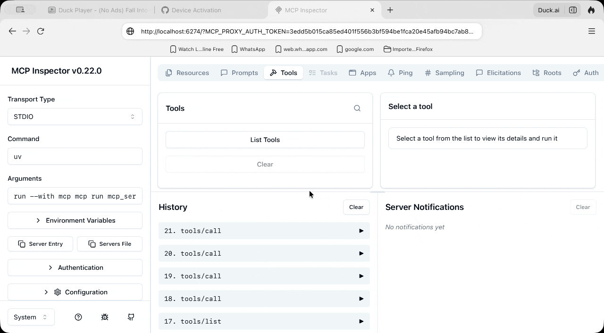
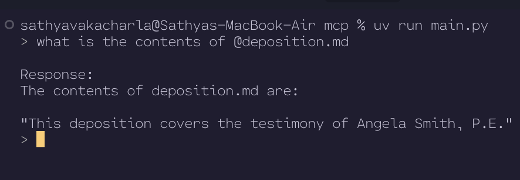

https://anthropic.skilljar.com/introduction-to-model-context-protocol
# MCP Chat

MCP Chat is a command-line interface application that enables interactive chat capabilities with AI models through the Anthropic API. The application supports document retrieval, command-based prompts, and extensible tool integrations via the MCP (Model Control Protocol) architecture.

## Prerequisites

- Python 3.9+
- Anthropic API Key

## Setup

### Step 1: Configure the environment variables

1. Create or edit the `.env` file in the project root and verify that the following variables are set correctly:

```
ANTHROPIC_API_KEY=""  # Enter your Anthropic API secret key
```

### Step 2: Install dependencies

#### Option 1: Setup with uv (Recommended)

[uv](https://github.com/astral-sh/uv) is a fast Python package installer and resolver.

1. Install uv, if not already installed:

```bash
pip install uv
```

2. Create and activate a virtual environment:

```bash
uv venv
source .venv/bin/activate  # On Windows: .venv\Scripts\activate
```

3. Install dependencies:

```bash
uv pip install -e .
```

4. Run the project

```bash
uv run main.py
```

#### Option 2: Setup without uv

1. Create and activate a virtual environment:

```bash
python -m venv .venv
source .venv/bin/activate  # On Windows: .venv\Scripts\activate
```

2. Install dependencies:

```bash
pip install anthropic python-dotenv prompt-toolkit "mcp[cli]==1.8.0"
```

3. Run the project

```bash
python main.py
```

## Usage

### Basic Interaction

Simply type your message and press Enter to chat with the model.

### Document Retrieval

Use the @ symbol followed by a document ID to include document content in your query:

```
> Tell me about @deposition.md
```

### Commands

Use the / prefix to execute commands defined in the MCP server:

```
> /summarize deposition.md
```

Commands will auto-complete when you press Tab.

## Development

### Adding New Documents

Edit the `mcp_server.py` file to add new documents to the `docs` dictionary.

### Implementing MCP Features

To fully implement the MCP features:

1. Complete the TODOs in `mcp_server.py`
2. Implement the missing functionality in `mcp_client.py`

### Linting and Typing Check

There are no lint or type checks implemented.

### Running the MCP Inspector

The MCP Inspector is a browser-based UI for testing MCP servers (tools, resources, prompts) without wiring up a full client. This project ships an MCP server in `mcp_server.py`; use the `mcp` CLI from the `mcp[cli]` package to launch it with the inspector.

#### Prerequisites

Before running the inspector, make sure you have completed [Step 2: Install dependencies](#step-2-install-dependencies) so the project virtual environment exists and `mcp[cli]` is installed. The inspector also requires **Node.js and npm** on your PATH — the `mcp dev` command uses `npx` to download and run `@modelcontextprotocol/inspector` on first launch.

#### Command that failed

From the project root, running the CLI directly without activating the virtual environment produced:

```bash
mcp dev mcp_server.py
```

**Error:**

```text
zsh: command not found: mcp
```

**Cause:** The `mcp` executable is installed inside the project virtual environment (`.venv/bin/mcp`) as part of the `mcp[cli]` dependency. It is not added to your global shell `PATH`, so the shell cannot find it when you run `mcp` on its own.

#### How we fixed it

Use one of the following approaches from the project root:

**Option 1 — via uv (recommended):**

```bash
uv run mcp dev mcp_server.py
```

**Option 2 — activate the virtual environment first:**

```bash
source .venv/bin/activate   # On Windows: .venv\Scripts\activate
mcp dev mcp_server.py
```

**Option 3 — call the venv binary directly:**

```bash
.venv/bin/mcp dev mcp_server.py
```

If you see `command not found: mcp` even after activating the venv, dependencies may not be installed yet. Run:

```bash
uv pip install -e .
```

#### Successful run output

After the fix, `uv run mcp dev mcp_server.py` started the MCP Inspector successfully. Example output:

```text
Starting MCP inspector...
⚙️ Proxy server listening on localhost:6277
🔑 Session token: <your-session-token>
   Use this token to authenticate requests or set DANGEROUSLY_OMIT_AUTH=true to disable auth

🚀 MCP Inspector is up and running at:
   http://localhost:6274/?MCP_PROXY_AUTH_TOKEN=<your-session-token>

🌐 Opening browser...
```

Open the URL printed in the terminal (it includes the auth token as a query parameter). The proxy listens on port **6277**; the inspector UI is served on port **6274**.

To test tools interactively in the inspector UI, connect to the server and invoke `read_doc` or `edit_doc` with a document ID from the `docs` dictionary in `mcp_server.py` (for example, `deposition.md`).

#### npm warnings (non-blocking)

On first run, npm may print warnings before the inspector starts. These did **not** prevent the inspector from working:

| Warning | Meaning | Action |
|--------|---------|--------|
| `Unknown env config "devdir"` | A custom npm config key is set in your environment or `.npmrc` that npm no longer recognizes. | Safe to ignore for local development, or remove the `devdir` entry from your npm config if you want to silence it. |
| `The following package was not found and will be installed: @modelcontextprotocol/inspector@...` | Expected on first run — `mcp dev` uses `npx` to fetch the inspector. | No action needed; subsequent runs may reuse the cached package. |
| `deprecated inflight`, `deprecated glob`, `deprecated node-domexception` | Transitive dependencies of the inspector package use older npm modules. | Informational only; they come from the inspector's dependency tree, not this repo. |

#### Troubleshooting

| Symptom | Likely cause | Fix |
|--------|--------------|-----|
| `zsh: command not found: mcp` | CLI not on PATH | Use `uv run mcp dev mcp_server.py`, or activate `.venv` first (see above). |
| `No module named 'mcp'` or import errors | Dependencies not installed | Run `uv pip install -e .` from the project root. |
| Inspector fails to start / npx errors | Node.js or npm missing | Install Node.js (e.g. via [nodejs.org](https://nodejs.org/) or Homebrew: `brew install node`). |
| Browser opens but connection fails | Wrong or expired session token | Copy the full URL from the terminal, including the `MCP_PROXY_AUTH_TOKEN` query parameter. |

#### Stopping the inspector

Press `Ctrl+C` in the terminal where `mcp dev` is running to stop the proxy and inspector.

Few working scenarios:


List Tools Function

This function gets all available tools from the MCP server:

async def list_tools(self) -> list[types.Tool]:
    result = await self.session().list_tools()
    return result.tools

It's straightforward - we access our session (the connection to the server), call the built-in list_tools() method, and return the tools from the result.
Call Tool Function

This function executes a specific tool on the server:

async def call_tool(
    self, tool_name: str, tool_input: dict
) -> types.CallToolResult | None:
    return await self.session().call_tool(tool_name, tool_input)

We pass the tool name and input parameters (provided by Claude) to the server and return the result.
Testing the Client

The client file includes a simple test harness at the bottom. You can run it directly to verify everything works:

uv run mcp_client.py

This will connect to your MCP server and print out the available tools. You should see output showing your tool definitions, including descriptions and input schemas.

Once the client functions are implemented, you can test the complete flow by running your main application:

uv run main.py

Try asking: "What is the contents of the report.pdf document?"

Here's what happens behind the scenes:

    Your application uses the client to get available tools
    These tools are sent to Claude along with your question
    Claude decides to use the read_doc_contents tool
    Your application uses the client to execute that tool
    The result is returned to Claude, who then responds to you

The client acts as the bridge between your application logic and the MCP server's functionality, making it easy to integrate powerful tools into your AI workflows.

check read_resource method in mcp_client and check 2 new resources added in mcp_server to understand the concept of accessing resources

